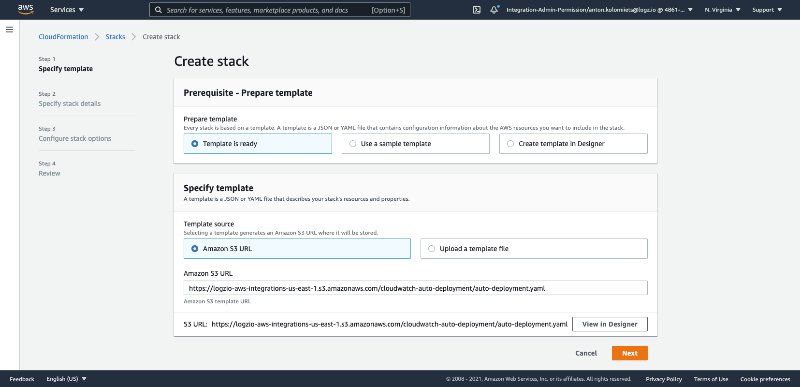
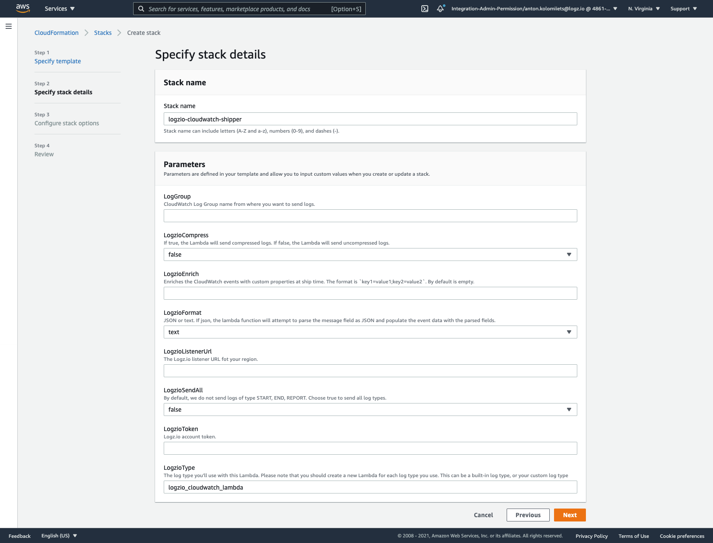

# CloudWatch Logs Shipper - Lambda

This is an AWS Lambda function that collects CloudWatch logs and sends them to Logz.io in bulk over HTTP.
For detailed information, read our [docs article](https://docs.logz.io/shipping/log-sources/cloudwatch.html).

- Option 1: [Manual Lambda configuration](#manual-lambda-configuration)
- Option 2: [Automated CloudFormation deployment](#automated-cloudformation-deployment)

<div id="manual-lambda-configuration">

## Manual configuration with a Lambda function

<div class="tasklist">
  
#### 1. Create a new Lambda function

This Lambda function will collect CloudWatch logs and sends them to Logz.io in bulk over HTTP.

Open the AWS Lambda Console, and click **Create function**.
Choose **Author from scratch**, and use this information:

- **Name**: We suggest adding the log type to the name, but you can name this function whatever you want.
- **Runtime**: Choose **Python 3.7**
- **Role**: Click **Create new role from template(s)**. Then, from the **Policy Templates** list, select **Basic Edge Lambda permissions**.

Click **Create Function** (bottom right corner of the page). After a few moments, you'll see configuration options for your Lambda function.

You'll need this page later on, so keep it open.

#### 2. Zip the source files

Clone the CloudWatch Logs Shipper - Lambda project from GitHub to your computer,
and zip the Python files in the `src/` folder.

```shell
git clone https://github.com/logzio/logzio_aws_serverless.git \
&& cd logzio_aws_serverless/python3/cloudwatch/ \
&& mkdir -p dist/python3/shipper; cp -r ../shipper/shipper.py dist/python3/shipper \
&& cp src/lambda_function.py dist \
&& cd dist/ \
&& zip logzio-cloudwatch lambda_function.py python3/shipper/*
```

You'll upload `logzio-cloudwatch.zip` in the next step.

#### 3. Upload the zip file and set environment variables

In the _Function_ code section of Lambda, find the **Code entry type** list. Choose **Upload a .ZIP file** from this list.

Click **Upload**, and choose the zip file you created earlier (`logzio-cloudwatch.zip`).

In the _Environment variables_ section, set your Logz.io account token, URL, and log type, and any other variables that you need to use.

###### Environment variables

| Parameter                                  | Description                                                                                                                                                                                                                                                                                                                                    |
| ------------------------------------------ | ---------------------------------------------------------------------------------------------------------------------------------------------------------------------------------------------------------------------------------------------------------------------------------------------------------------------------------------------- |
| TOKEN (Required)                           | The [token](https://app.logz.io/#/dashboard/settings/general) of the account you want to ship to.                                                                                                                                                                                                                                              |
| LISTENER_URL (Required)                    | Determines protocol, listener host, and port. For example, `https://<<LISTENER-HOST>>:8071`. <br > Replace `<<LISTENER-HOST>>` with your region's listener host (for example, `listener.logz.io`). For more information on finding your account's region, see [Account region](https://docs.logz.io/user-guide/accounts/account-region.html) . |
| TYPE (Default: `logzio_cloudwatch_lambda`) | The log type you'll use with this Lambda. This can be a [type that supports default parsing](https://docs.logz.io/user-guide/log-shipping/built-in-log-types.html), or a custom log type. <br> You'll need to create a new Lambda for each log type you use.                                                                                   |
| FORMAT (Default: `text`)                   | `json` or `text`. If `json`, the Lambda function will attempt to parse the message field as JSON and populate the event data with the parsed fields.                                                                                                                                                                                           |
| COMPRESS (Default: `false`)                | Set to `true` to compress logs before sending them. Set to `false` to send uncompressed logs.                                                                                                                                                                                                                                                  |
| SENDALL (Default: `false`)                 | By default, we do not send logs of type START, END, REPORT. Change to `true` to send all log data                                                                                                                                                                                                                                              |
| ENRICH                                     | Enrich CloudWatch events with custom properties, formatted as `key1=value1;key2=value2`.                                                                                                                                                                                                                                                       |

#### 4. Configure the function's basic settings

In Basic settings, we recommend starting with these settings:

- **Memory**: 512 MB
- **Timeout**: 1 min 0 sec

**Note**:
These default settings are just a starting point.
Check your Lambda usage regularly, and adjust these values if you need to.

#### 5. Set the CloudWatch Logs event trigger

Find the **Add triggers** list (left side of the Designer panel). Choose **CloudWatch Logs** from this list.

Below the Designer, you'll see the Configure triggers panel. Choose the **Log group** that the Lambda function will watch.

Type a **Filter name** (required) and **Filter pattern** (optional).

Click **Add**, and then click **Save** at the top of the page.

#### 6. Check Logz.io for your logs

Give your logs some time to get from your system to ours, and then open [Kibana](https://app.logz.io/#/dashboard/kibana).

If you still don't see your logs, see [log shipping troubleshooting](https://docs.logz.io/user-guide/log-shipping/log-shipping-troubleshooting.html).

</div>

</div>
<!-- tab:end -->

<!-- tab:start -->
<div id="automated-cloudformation-deployment">

## Automated CloudFormation deployment

**Before you begin, you'll need**:
"This is an AWS Lambda function that's subscribes to the CloudWatch log groups and sends them to Logz.io in bulk, over HTTP."

<div class="tasklist">

## Getting Started

To start just press the button and follow the instructions:

[](https://console.aws.amazon.com/cloudformation/home?region=us-east-1#/stacks/create/template?templateURL=https://logzio-aws-integrations-us-east-1.s3.amazonaws.com/cloudwatch-auto-deployment/auto-deployment.yaml&stackName=logzio-cloudwatch-shipper)

You'll be taken to AWS, where you'll configure the resources to be deployed. Keep the defaults and click Next:



Fill in all the stack parameters and click **Next**:



| Parameter                                      | Description                                                                                                                                                                                                                             |
| ---------------------------------------------- | --------------------------------------------------------------------------------------------------------------------------------------------------------------------------------------------------------------------------------------- |
| LogzioToken (Required)                         | Replace `<<SHIPPING-TOKEN>>` with the [token](https://app.logz.io/#/dashboard/settings/general) of the account you want to ship to.                                                                                                     |
| LogGroup\*                                     | CloudWatch Log Group name from where you want to send logs.                                                                                                                                                                             |
| LogzioListenerUrl                              | listener host, and port (for example, `https://<<LISTENER-HOST>>:8071`). <br > The [token](https://app.logz.io/#/dashboard/settings/general) of the account you want to ship to.                                                        |
| LogzioType (Default: `logzio_cloudwatch_logs`) | The log type you'll use with this Lambda. This can be a [built-in log type](https://docs.logz.io/user-guide/log-shipping/built-in-log-types.html), or a custom log type. <br> You should create a new Lambda for each log type you use. |
| LogzioFormat (Default: `text`)                 | `json` or `text`. If `json`, the Lambda function will attempt to parse the message field as JSON and populate the event data with the parsed fields.                                                                                    |
| LogzioSendAll (Default: `false`)               | By default, we do not send logs of type START, END, REPORT. Change to `true` to send all log data                                                                                                                                       |
| LogzioCompress (Default: `false`)              | Set to `true` to compress logs before sending them. Set to `false` to send uncompressed logs.                                                                                                                                           |
| LogzioEnrich                                   | Enrich CloudWatch events with custom properties, formatted as `key1=value1;key2=value2`.                                                                                                                                                |

\*LogGroup
You can find it in CloudWatch Page title of the log group for what you want to subscribe to receive logs, and transfer it to the logz.io.


On the following screen, fill Tags to easily identify your resources and press Next:


On the final screen, AWS will automatically show a notice requesting that you acknowledge that AWS CloudFormation might create IAM resources. Check the box and click Create Stack:


</div>
<!-- tab:end -->

</div>
<!-- tabContainer:end -->
